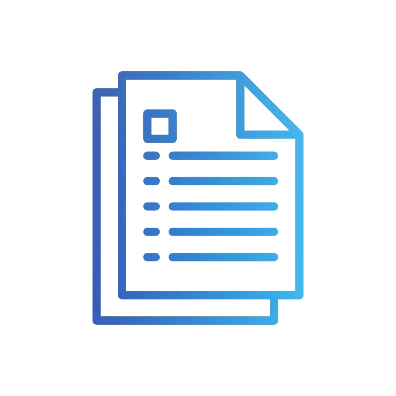
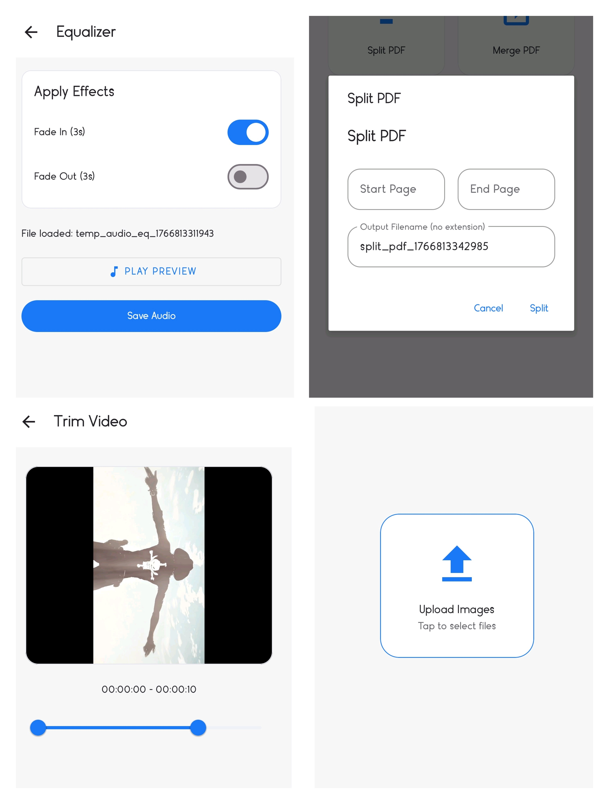

<!-- PROJECT SHIELDS -->

<!-- PROJECT LOGO & TITLE -->
 

  <a href="#">
    <!-- Use a relative path so GitHub will render the image from this repository -->
    
  </a>

  <h1 align="center">N-Lab</h1>

  

    <b>The Ultimate Native Android Swiss-Army Knife for Media & Docs</b>
     
    <i>Architected by Nithish</i>
     
     
    <a href="#-demo">View Demo</a>
    ·
    <a href="#-bug-report">Report Bug</a>
    ·
    <a href="#-feature-request">Request Feature</a>
  

---

### ⚡ System Overview

**N-Lab** is a high-performance engine built on **Native Android (Kotlin)**. It bridges the gap between static documents and dynamic media, leveraging industry-standard libraries to perform heavy proc[...]

> **Current Status:** 🟢 Active Development | **Maintainer:** Nithish

---

### 🛠️ The Arsenal (Tech Stack)

This project leverages a heavy-hitting stack to ensure performance and reliability:

| Component | Technology / Library | Capability |
| :--- | :--- | :--- |
| **Core Logic** | `Kotlin + Coroutines` | Asynchronous, non-blocking operations. |
| **PDF Engine** | `iText7 Core` | Enterprise-grade PDF generation & manipulation. |
| **Media Core** | `RxFFmpeg` | FFmpeg wrapper for complex Audio/Video processing. |
| **Visuals** | `Glide` + `UCrop` | High-performance image loading & cropping. |
| **Docs** | `Apache POI` | Read/Write MS Word & Excel files natively. |
| **Audio Viz** | `WaveformSeekBar` | Real-time audio spectrum visualization. |

---

### 📸 Interface Preview

 
  <!-- Use relative paths (recommended). If you prefer absolute raw URLs, convert to raw.githubusercontent.com or add ?raw=true -->
  
  
  

---

### 🚀 Quick Deploy

Get this running on your local machine in under 5 minutes.

**Prerequisites:**
*   Android Studio (Hedgehog or later)
*   JDK 17
*   Android Device/Emulator (API 24+)

**Terminal Instructions:**

---

### 📂 Architecture Map

A high-level view of the source tree structure:

---

### 🤝 Contributing

Contributions are what make the open-source community such an amazing place to learn, inspire, and create. Any contributions you make are **greatly appreciated**.

1.  Fork the Project
2.  Create your Feature Branch (`git checkout -b feature/AmazingFeature`)
3.  Commit your Changes (`git commit -m 'Add some AmazingFeature'`)
4.  Push to the Branch (`git push origin feature/AmazingFeature`)
5.  Open a Pull Request

---

### 📝 License

Distributed under the MIT License. See `LICENSE` for more information.

 

  <b>Built by NITHISH</b>
   
  <i>Code hard. Ship faster.</i>

